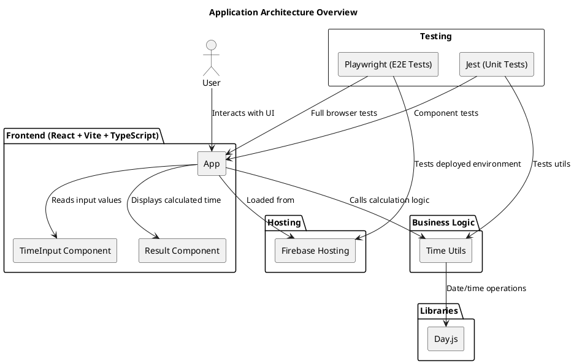

# Overview

The application is a simple time calculator built with React and TypeScript. Although the feature set is small, the architecture follows scalable patterns suitable for larger applications.

# Key Architectural Concepts

## Component-Based Structure

All UI pieces are implemented as isolated React components with their own state and props. This simplifies testing and maintenance.

## Business Logic Isolation

Core time-related logic is placed in utility modules under src/util.
This avoids mixing UI rendering with business rules.

## State Management

Local component state is used because the application is small. The design allows easy migration to Zustand, Redux, or other global state systems if the need arises.

## Library Choices

- React – UI rendering
- Day.js – Lightweight date/time manipulation
- Material UI – UI components
- Vite – Fast development build tool
- TypeScript – Static typing and improved maintainability

## Folder Structure

```bash
src/
  components/   # Reusable UI components
  util/         # Time calculation and formatting utilities
  tests/        # Unit and integration tests
  App.tsx       # Main application entry point
```

## Release and Versioning Architecture

The project uses a fully automated release pipeline powered by semantic-release.  
This system analyzes commit messages, determines the next semantic version, generates release notes, updates the changelog, and publishes a GitHub Release without any manual steps.

### Key Concepts

- **Conventional Commits** are used as the single source of truth for determining the release type (patch, minor, major).
- **semantic-release** performs:
  - Version analysis (`fix`, `feat`, `feat!`)
  - Automatic version bump of `package.json`
  - Changelog generation (stored under `docs/changelog.md`)
  - Git tagging
  - Publishing GitHub Releases

### Why this matters

This architecture ensures consistent versioning, reproducible releases, and transparent change history. It also removes human error from the release process and integrates seamlessly with the CI/CD pipelines.

# Design Goals

- High readability and clean code
- Full testability
- Separation of concerns
- Deterministic time results for reliable tests

# Diagram


