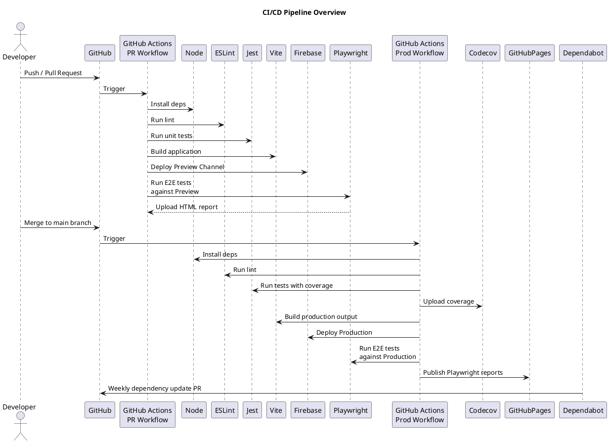

# Introduction

This project demonstrates a complete CI/CD setup built around GitHub Actions. The pipeline ensures reliable testing, preview environments, and production deployment.

# CI/CD Pipeline Stages

1. Pull Request Workflow
   - Install dependencies
   - Run ESLint
   - Run Jest unit tests with coverage
   - Build the project
   - Deploy a temporary Firebase Hosting preview channel
   - Run Playwright E2E tests against the preview environment
   - Publish Playwright reports as build artifacts

2. Production Deployment Workflow
   Triggered on pushes to main: - Install dependencies - Lint and test - Upload coverage to Codecov - Build production output - Deploy to Firebase Hosting - Run Playwright tests against production - Publish reports and documentation to GitHub Pages

3. Scheduled Dependency Updates
   Dependabot runs weekly to update direct dependencies except major versions.

## Automated Release Workflow

Releases are fully automated and triggered on each push to the `main` branch.  
The CI pipeline executes semantic-release, which performs the following steps:

1. **Analyze commit messages** using the Conventional Commits format.
2. **Determine the next version** (patch, minor, major).
3. **Update the changelog** (`docs/changelog.md`) using the official changelog plugin.
4. **Update `package.json`** with the new version number.
5. **Create and push a Git tag** for the release.
6. **Create a GitHub Release** including auto-generated release notes.
7. **Commit updated files** back to the repository.

### Branch Strategy

Release automation only runs on the `main` branch.  
Pull requests are validated using a PR title linter to ensure that all PR titles follow the Conventional Commits format. This guarantees predictable and consistent versioning during the release step.

### Benefits

- No manual tagging
- No manual changelog editing
- Prevents inconsistent versioning
- Provides clear release notes for every version
- Works seamlessly with automated deployments

# Goals of the Pipeline

- Prevent merging untested code
- Provide preview environments for every pull request
- Automatically validate UI behavior with E2E tests
- Produce transparent build artifacts and reports
- Enforce code quality with linting and formatting

# Diagram

